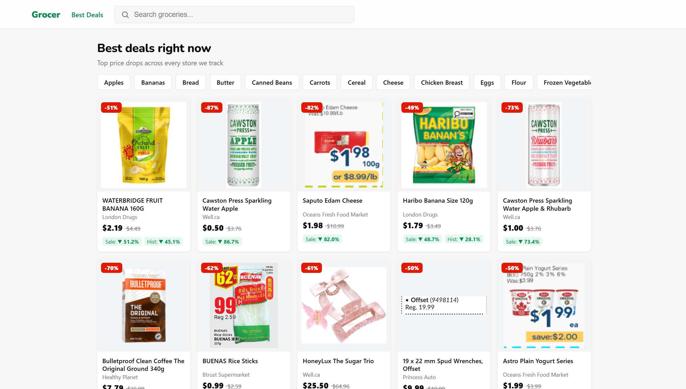

# Grocer: Canadian Grocery Price Intelligence

**[Live Demo](https://grocer-vqme.onrender.com)**

Grocery flyers tell you what's on sale, but don't tell you whether the sale price is
actually good. Grocer tracks live pricing across Canadian retailers, keeps a full price
history, and tells you which store is cheapest for this item and if the price is actually a deal.



---

## What it does

- **Cross-store comparison** - search an item, see it priced across every retailer
  carrying it, sorted cheapest first
- **Deal detection** - 3 independent signals which are all shown separately
- **Price history** - every observation is retained, so an item's price can be judged
  against its own past
- **National baseline** - prices benchmarked against Statistics Canada retail averages

---

## Data sources

**Flipp backend API** - live cross-store pricing, pulled from 2 arrays in the same
response: `ecom_items[]` (online listings) and `items[]` (weekly flyer/print-ad listings,
stored as `source='flyer'`). The 2 arrays cover almost entirely different retailers.
`ecom_items[]` surfaces Walmart and national drugstore/office/hardware retailers (Shoppers
Drug Mart, London Drugs, Well.ca, Healthy Planet, RONA, Staples, Bureau en gros, Best Buy). `items[]` includes Metro, Sobeys,
Food Basics, Real Canadian Superstore, Loblaws, No Frills, FreshCo, Fortinos, Longos, Farm
Boy, Your Independent Grocer, and a long tail of regional grocers. Adding flyer ingestion
took total merchant coverage from 9 to 59. See [Flyer pricing](#flyer-pricing) below.

**Statistics Canada, Table 18-10-0245-01** - *Monthly average retail prices for selected
products.* Built from retailer point-of-sale transaction data, published monthly by
the province. Used as a historical baseline.

### Work process

The first approach for this project was scraping retailer sites directly. I attempted Loblaws, Metro,
Sobeys, No Frills, and FreshCo. **All five block automated access.**

In order, I attempted the following:

| Attempt | Result |
|---|---|
| `requests` + BeautifulSoup | 403, Akamai bot protection (Loblaws, Sobeys, No Frills), CAPTCHA (Metro) |
| Checking for embedded JSON (`__NEXT_DATA__`) | Present in-browser, unreachable programmatically |
| Playwright, headless | Access Denied |
| Playwright, headed browser | Access Denied |
| Playwright + `playwright-stealth` | Access Denied |

Every major Canadian grocery chain runs enterprise bot protection, and it defeats a
stealthed real browser. Rather than escalating into proxy rotation and commercial
anti-detection tooling, I found that Flipp, which aggregates pricing from Canadian
retailers, exposes an unauthenticated backend serving equivalent data without needing to
defeat bot protection at all.

**The pivot didn't fully close the coverage gap on its own.** `ecom_items[]` alone returns
Walmart and a mix of drugstore, office-supply, and hardware retailers instead of the big grocery
banners that blocked direct scraping. That turned out to be an endpoint choice rather than a Flipp
limitation. The same API response also carries an `items[]` array (the weekly flyer data),
and that's where Metro, Sobeys, No Frills, Loblaws, FreshCo, and the rest of the banners
actually show up. Parsing that second array (below) closed the gap the scraping attempts
couldn't.

---

## Flyer pricing

`items[]` and `ecom_items[]` come from the same request but aren't the same shape:

| | `ecom_items[]` | `items[]` (flyer) |
|---|---|---|
| Product identifier | `sku` (persistent) | no `sku`, only `id` / `flyer_item_id`, scoped to one flyer run |
| Merchant name field | `merchant` | `merchant_name` |
| Price | `current_price` | `current_price` |
| Regular price | `original_price` (usually present) | `original_price` (often `null`) |
| Deal text | - | `sale_story`, e.g. `"SAVE 29%"`, `"Earn PC Optimum 1,000 pts"` |
| Validity window | - | `valid_from` / `valid_to` (ISO datetime, when the flyer price applies) |

**No persistent product ID for flyer items.** `ingest.py` uses `id` as the sku surrogate,
which means the same physical product gets a *new* item row every time its flyer cycles
(typically weekly) rather than continuing an existing one. Flyer-sourced items don't
accumulate the multi-week price history that ecom items do. The "own price history" deal
signal is much weaker for them. This is a property of the data Flipp exposes, not a bug.

**"Current price" means something different per source.** An ecom observation is current if
it's the most recent one on record. Prices there update in place, so recency is the right
test. A flyer observation is only current if today falls inside `[valid_from, valid_to]`;
recency alone isn't enough, since a stale flyer row would otherwise keep surfacing as "the
price" indefinitely if `ingest.py` weren't re-run after it expired. `main.py`'s `latest` CTE
went from this:

```sql
WITH latest AS (
    SELECT DISTINCT ON (item_id)
        item_id, current_price, original_price
    FROM price_observations
    ORDER BY item_id, observed_at DESC
),
```

to this:

```sql
WITH latest AS (
    SELECT DISTINCT ON (item_id)
        item_id, current_price, original_price, source, sale_story, valid_from, valid_to
    FROM price_observations
    WHERE source = 'ecom'
       OR (source = 'flyer' AND CURRENT_DATE BETWEEN valid_from AND valid_to)
    ORDER BY item_id, observed_at DESC
),
```

ecom rows are untouched; flyer rows outside their validity window are excluded before the
`DISTINCT ON` picks the most recent survivor. If an item's only observations are expired
flyer rows, it now correctly drops out of `/search`, `/deals`, and `/product` entirely rather
than showing a stale price. This was verified by inserting a same-item observation with an expired
window and confirming the still-valid row wins regardless of which was inserted more
recently, and that an item with *no* currently-valid observation returns zero rows. The
`/history` endpoint is unaffected on purpose. It's meant to show the full time series,
expired flyers included, so it's not "latest price" logic. `source` and `sale_story` are now
exposed on every offer/deal/history point, so the frontend can label a flyer deal
distinctly from an online price and show its validity dates.

One more thing the flyer data surfaces that ecom never did is that some flyer entries are
loyalty-points or percentage-off promos with no dollar price at all (`"SAVE 10%"`, `"Get PC
Optimum 10,000 pts"`, both `current_price` and `original_price` null). Those aren't usable
for price comparison so `ingest.py` skips them at ingestion rather than storing an
unpriced row.

---

## Product matching

Retailers name the same product differently:

```
London Drugs → "Villaggio Bread - Italian Style in White Size 510g"
Walmart      → "Villaggio® Artesano White Sliced Bread"
```

Without reconciling these, cross-store comparison is impossible since there is no shared key
to join on.

**Two-stage approach:**

1. **`rapidfuzz` pre-filter** - cheap string similarity, gated by a parsed-quantity check
   (`quantity_compatible`), eliminates obvious non-matches and literal size mismatches before
   the expensive stage runs. Comparing every item against every other is O(n²); embedding all
   of those pairs would be wasteful, so this stage cuts the candidate set first.
2. **Sentence-transformer embeddings** (`all-MiniLM-L6-v2`) + cosine similarity, clusters
   the survivors semantically.

**Why embeddings rather than string matching alone.** Two listings for the same product can
share almost no tokens (different brand-name conventions, different retailer templates),
while two listings for genuinely different pack sizes of the same item can look nearly
identical as strings. Embeddings capture the semantic relationship that character overlap
misses; the explicit quantity gate in stage 1 backstops the size-confusion case separately,
since embeddings alone don't reliably encode magnitude.

**Flyer names broke the rapidfuzz stage, not the embedding stage or the quantity parser.**
Flyer names are frequently ALL CAPS (`"NEILSON TRUTASTE MICROFILTERED MILK, 4 L"`) where ecom
names are mixed case. `rapidfuzz.fuzz.token_sort_ratio` is case-sensitive. The identical
string in two different cases scores ~42, not 100, so cross-source pairs for the same
product were silently failing the stage-1 prefilter (threshold 40) before ever reaching
embeddings. The quantity parser was unaffected (its regex is already case-insensitive; sizes
and units are case-invariant by nature). Fix was to lowercase names going into the rapidfuzz
comparison only, not the embeddings (`all-MiniLM-L6-v2` is an uncased model, cosine
similarity is 1.0 for the same text in different cases, so it never needed the fix). After
the fix, re-running matching over the flyer-expanded item set produced 112 groups that
correctly bridge an ALL-CAPS flyer name with a mixed-case ecom name for the same product. 
Those would have been silently dropped before.

**Where it fails.** I manually reviewed all 78 cross-merchant candidate groups from the
ecom-only pipeline (204 candidate item-pairings, preserved at
`candidate_groups.reviewed.pre-flyer.csv`): 80% of individual item-matches were correct on
the first pass, and 74% of groups (58/78) needed no correction at all. Size confusion was
*not* a meaningful failure mode. The quantity gate catches that before it reaches the
embedding stage. The real errors clustered into three patterns:

- **Flavor variants folded into a base product**. Ezekiel 4:9 bread's Cinnamon Raisin, Flax,
  and Sesame lines all got merged into the same group as the plain Whole Grain loaf.
- **Formulation variants of the same brand/size merged**. Bob's Red Mill "All Purpose Baking
  Flour" and "1 to 1 Baking Flour" (same weight, same brand) clustered together despite being
  different products.
- **Adjacent product lines from the same brand crossing over**. Bertolli "Extra Virgin" and
  "Extra Light Taste" olive oil, and Walmart's different Villaggio bread types, occasionally
  landed in the same cluster.

These were corrected by hand (`fix_groups.py`) rather than by retuning the similarity
threshold, since tightening it enough to split flavor variants started splitting genuine
duplicates too. The threshold is a precision/recall dial. Loosen it and variants merge,
tighten it and duplicates fracture. 0.75 cosine similarity was the best tradeoff found by
eye, not by a held-out validation set.

**Flyer text introduced a failure mode ecom listings didn't have.** Re-running the matching
pipeline on the flyer-expanded item set produced 298 cross-merchant candidate groups (954
rows, written fresh to `candidate_groups.csv`, not yet manually reviewed. The ecom-only
review above is a baseline, not a validation of this larger set). Spot-checking a sample
surfaced a pattern that's structural, not a tuning problem. Some flyer lines describe
*several* products at once as a single ad slot, such as
`"Kicking Horse Ground Coffee 284 g or McCafe Ground Coffee 300 g or McCafe K-Cup Pods 12 pk",`
or describe a category rather than a specific product.
`"GENERAL MILLS CEREAL, 317-778 G"` matched near-identically across six different banners'
flyers, even though it could mean Cheerios at one store and Lucky Charms at another. Neither
rapidfuzz nor the embedding model can resolve this. The ambiguity is in the source text
itself, not in how it's compared. Filtering or splitting `"X or Y or Z"` flyer lines before
they enter matching is the natural next step; not yet implemented.

---

## Deal detection

3 signals, each with a different reliability and availability profile:

| Signal | Source | Available | Weakness |
|---|---|---|---|
| Discount depth | listed regular vs. current price | Immediately | Gameable, regular prices can be inflated |
| Own price history | accumulated observations | After several weeks | Most relevant, but needs time |
| National baseline | StatCan monthly averages | Immediately | Coarse, lagged, generic categories |

**These are surfaced independently rather than averaged into a single score.** Collapsing
them would hide which signal fired, making a wrong flag impossible to diagnose. A composite
is computed for sort ordering only, with the components still exposed in the API response.

---

## Design decisions

**Append-only price observations.** The obvious schema puts a `current_price` column on the
items table and updates it each run. That's simpler, but the moment
you overwrite, price history is gone, and history is what makes "is this a good deal"
answerable. Every ingestion run inserts timestamped rows instead of mutating existing ones.

*Tradeoff:* the table grows continuously, and "what is the current price" becomes a window
function rather than a plain `SELECT`. Query complexity was accepted in exchange for
retaining history.

**Rules before models for deal detection.** Deal classification is threshold logic and not a
trained model. It works from day one with no training data, and it's fully explainable, since the app can state exactly why something 
was flagged. A learned classifier would have added opacity without improving accuracy at this data volume.

---

## Architecture

```
Flipp API ─┬─ ecom_items[] (source=ecom)  ─┐
           └─ items[]      (source=flyer) ─┼─→ ingest.py ─→ PostgreSQL (Supabase) ─→ FastAPI ─→ React frontend
StatCan ───────────────────────────────────┘         │
                                                       └─→ product matching (rapidfuzz + embeddings)
```

**Stack:** Python 3.12, FastAPI, PostgreSQL (Supabase), React + TypeScript,
sentence-transformers, rapidfuzz, pandas. Single Render web service serves both halves.

Ingestion (`ingest.py`) runs on a schedule via GitHub Actions (`.github/workflows/ingest.yml`,
see below). Product matching (`match_candidates.py` → manual CSV review →
`commit_groups.py`) is still run by hand; it involves a human review step by design, so it
isn't a scheduling candidate the same way ingestion is.

### Deployment

One Render web service runs `uvicorn main:app`, and that same FastAPI process serves both
the API and the built React app.

**Why the API moved under `/api/*`.** The React app and the API used to be able to share
bare paths like `/search` because they lived on different ports in dev. Once they share an
origin, that stops being safe: react-router's client-side route is `/search`, and the old
FastAPI route was also literally `/search` (requiring a `q` query param). A browser
refresh or direct link to `/search?q=milk` would've hit FastAPI's `/search` handler first
and gotten back raw JSON instead of the page. Namespacing every API route under `/api/*`
(`/api/search`, `/api/deals`, `/api/product`, `/api/history`, `/api/categories`) removes the
collision entirely. The frontend's routes and the API's routes no longer share a
namespace. `frontend/src/api.ts` calls `/api/*` unconditionally now (no more
`VITE_API_BASE`/absolute-URL logic); it works identically in production (same origin) and
in dev, where `vite.config.ts` proxies `/api/*` to `http://127.0.0.1:8000` so `npm run dev`
still talks to a local FastAPI server without a CORS round trip.

**How one path serves both.** `main.py` registers every `/api/*` route first, then at the
bottom mounts `frontend/dist/assets` for the built JS/CSS and adds a catch-all
`GET /{full_path:path}` route. Starlette matches routes in the order they're registered, so
`/api/search` always resolves to the real endpoint; anything else either matches a real file
in `dist` (e.g. `/favicon.svg`) or falls back to `dist/index.html`, letting react-router take
over client-side for paths like `/search` or `/item/group/42` that aren't real files on disk.

**Render configuration:**

- **Build Command:**
  ```
  pip install -r requirements.txt && cd frontend && npm install && npm run build && cd ..
  ```
  Installs the Python deps and builds the frontend into `frontend/dist` in the same build
  step, so it's sitting there when `uvicorn` starts. `frontend/dist` stays gitignored.
- **Start Command** (should already be set, since the API-only deploy was already working):
  ```
  uvicorn main:app --host 0.0.0.0 --port $PORT
  ```

### Ingestion schedule

`.github/workflows/ingest.yml` runs `ingest.py` on a cron schedule (every 2 days) plus
`workflow_dispatch` for manual runs. Two reasons: it's how price history actually
accumulates over time (the whole basis for the "own price history" deal signal), and it
keeps the Supabase free-tier project from auto-pausing after a week of inactivity.

It installs from `requirements-ingest.txt`, not the full `requirements.txt`. Ingestion
itself only needs `requests`, `psycopg2-binary`, and `python-dotenv`; the rest of
`requirements.txt` (`sentence-transformers`, `scikit-learn`, `pandas`, `fastapi`, ...) is for
the API and the separate, manually-run matching pipeline, and installing it on every
scheduled run would mean downloading `torch` for no reason every 2 days. `ingest.py` never
imports `sentence-transformers` or `torch`; matching is a fully separate script, never
invoked by ingestion.

The workflow needs one repository secret: **`Settings → Secrets and variables → Actions →
New repository secret`**, name `DATABASE_URL`, value the same Supabase connection string
from your local `.env` (session pooler, port 5432). `db.py` already reads
`os.environ["DATABASE_URL"]`. `load_dotenv()` no-ops when there's no `.env` file, which is
exactly the case on the runner, so no code changes were needed for the connection itself.

---

## Limitations & future work

- **Flyer item identity resets every cycle.** No persistent SKU for flyer-sourced items means
  no continuous week-over-week price history for them (see [Flyer pricing](#flyer-pricing)).
  A stable cross-flyer product key (matching on name+merchant+size across cycles, similar to
  the product-matching pipeline) would be needed to fix this.
- **Flyer candidate groups are unreviewed.** The 298-group, 954-row candidate set produced by
  re-running matching on the flyer-expanded data hasn't been through the manual y/n review the
  original 78-group ecom set got (see Product matching). Multi-product flyer lines
  (`"X or Y or Z"`) are a known source of false positives in it.
- **Product matching is still manual.** Ingestion is scheduled (see
  [Ingestion schedule](#ingestion-schedule)), but matching involves a human review step by
  design, so it's run by hand, not on a cron.
- **Sale-cycle prediction** is the natural extension, predicting *when* an item will next
  be discounted. Not implemented; it requires months of observed sale cycles to distinguish
  real periodicity from noise, and the dataset currently spans weeks. The pipeline
  accumulates the necessary history automatically, so this becomes buildable over time.
- **StatCan mapping is approximate.** StatCan reports monthly provincial averages for
  generic categories; Flipp reports live store-level branded prices. Statistics Canada also
  notes that average prices should be interpreted cautiously over time, and that the CPI is
  the appropriate measure for tracking price change. The baseline is used here as a rough
  reference point, not an inflation measure.
- **Coverage is limited to the tracked basket** of 24 common grocery search terms (milk,
  eggs, bread, chicken breast, bananas, rice, butter, cheese, apples, potatoes, onions,
  pasta, cereal, orange juice, yogurt, tomatoes, carrots, lettuce, ground coffee, olive oil,
  flour, sugar, canned beans, frozen vegetables), since the upstream API is
  search-driven rather than catalogue-driven.
- **Regional scope**, pricing is fetched for a single postal code.

---

## Running locally

```bash
git clone https://github.com/nupoor1/Grocer.git
cd Grocer
pip install -r requirements.txt
```

Create a `.env` file:

```
DATABASE_URL=postgresql://...
```

Set up the database, ingest prices, and start the API:

```bash
psql $DATABASE_URL -f schema.sql
python ingest.py
uvicorn main:app --reload
```

Frontend:

```bash
cd frontend
npm install
npm run dev
```
